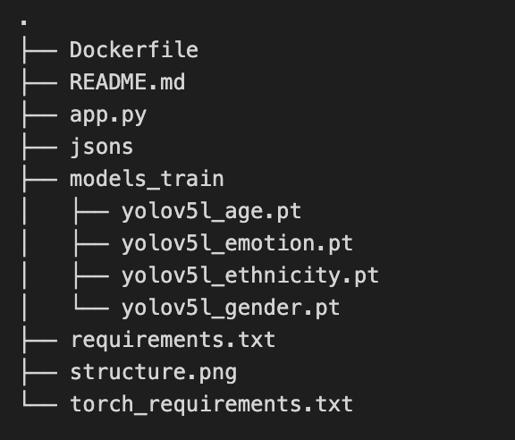

# Deploy a web service for YOLOv5 using Flask

## Instructions before using code

Please download the model weights from [Google Drive](https://drive.google.com/drive/folders/1a7y-JOX-hIjkyIQTgAV_CBYyeUTPJCfX?usp=sharing) and place them into the 'models_train' folder (See below).



## Instructions for running the code

Launch your application locally on your computer (in local virtual environment or in Docker): 
```console
# LOCAL NEW VIRTUAL ENV
pip install -r torch_requirements.txt
pip install -r requirements.txt
python app.py
```

```console
# DOCKER
# building docker image
docker image build -t flask_yolov5:latest .

# running docker container (interactively, deleted when exit)
docker run --rm -it -p 5000:5000 flask_yolov5:latest

# uploading docker image to personal account
docker image tag flask_yolov5:latest USRNAME/flask_yolov5:latest
docker image push USRNAME/flask_yolov5:latest
docker system prune
```

Once started, your application should be available on http://localhost:5000.


## Credit:
This repo is build on https://github.com/ovh/ai-training-examples/tree/main/jobs/yolov5-web-service
